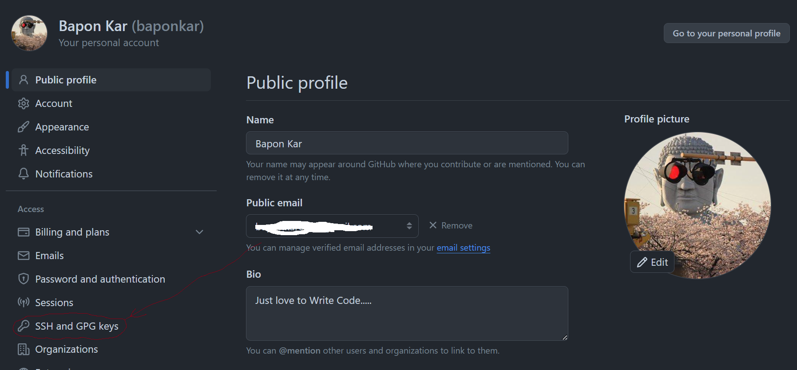
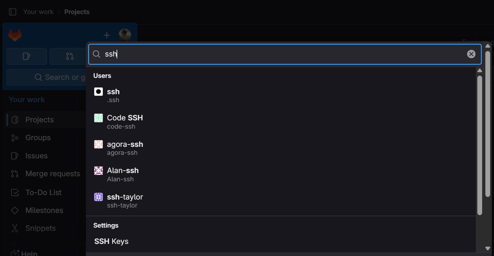

<head>
  <!-- primary meta tags-->
  <title>Manage Multiple GitHub/GitLab Account</title>
  <meta name="title" content="Manage Multiple GitHub/GitLab Account">
  <meta name="description" content="In this article I have shown how to manage multiple GitHub or GitLab Account by SSH Key.">

  <!--favicon-->
  <link rel="shortcut icon" href="./image/favicon.png" type="image/png">
</head>


[](https://git-scm.com/)
[](https://github.com)
[](https://gitlab.com)

# How to manage multiple GitHub or GitLab accounts
#### Published on July 20, 2024

We can communicate GitHub and GitLab Repository from our local machine by HTTPS and SSH. 
 Suppose you have multiple [GitHub](https://github.com) or [GitLab](https://gitlab.com) accounts and need all accounts to push and pull projects. Then it is boring to type username and password in every time. The best option is to add an SSH Key for each account then you don't need to type a username and password for every single push and pull. I am going to show the process of how to create and add an SSH key in this article.


## GitHub 

* It is always good practice to see the official documentation [GitHub](https://docs.github.com/en/authentication/connecting-to-github-with-ssh) [GitLab](https://docs.gitlab.com/ee/user/ssh.html).

I am going to assume you have two user ID ```username1``` and ```username2``` which are registered with EmailID ```username1@example.com``` and ```username2@example.com``` in GitHub respectively.  

## Step -1 : Creating an SSH key for ```username1```:

```(bash)
    ssh-keygen -t rsa -b 4096 -C "username1@example.com"
```

<span style="color:powderblue"> During creation of ssh key asked to location/filename and type a passphrase.Which will create two file one with filename and other with .pub extension.
 </span>

 To see the created file in .ssh folder if you have choose to store in there  ```ls -a ~/.ssh/``` .

##  Step - 2: Start the SSH and adding the generated Key:

```(bash)
eval "$(ssh-agent -s)"
ssh-add ~/.ssh/id_rsa_username1
```

##  Step - 3: Adding SSH Key in GitHub:
- LogIn into the GitHub Account with ```username1@example.com``` with password.

- Navigate to Settings > SSH Keys.



- Ensure your key is listed. If not, paste the copied key and add it.

## Step 4 : Verify the SSH Connection:

```(bash)
    ssh -T git@github.com
```

If everything is going perfect then you will see 

`Hi username1! You've successfully authenticated, but GitHub does not provide shell access.`


Now you are ready to communicate GitHub via SSH for ```usernam1``` account.

* To activate SSH for  ```username2``` you need to perform all above four steps for `username2`.

* Now create a config file by ```~/.ssh/config``` inside of `~/.ssh/` directory location.

The content of config file :
```(bash)
# GitHub Username1 Account
Host github-username1
    HostName github.com
    User git
    IdentityFile ~/.ssh/id_rsa_username1

# GitHub Username2 Account
Host github-username2
    HostName github.com
    User git
    IdentityFile ~/.ssh/id_rsa_username2
```

* To clone a repository
```(bash)
git clone https://github.com/username/repository.git
```

* To push from local repository to web repository
```(bash)
echo "# Repository Name" >> README.md
git init
git add README.md
git commit -m "first commit"
git branch -M main
git remote add origin git@github.com:username/repository.git
git push -u origin main
```

* To check remote url for a repository

```
git remote -v
```

* To change HTTPS remote url to SSH remote url
```
git remote set-url origin git@github.com:username/repository.git
```

------------------------------------------------
## GitLab

Follow similar steps as above to set up SSH keys for GitLab accounts. The documentation for GitLab SSH keys can be found [here](https://docs.gitlab.com/ee/user/ssh.html).

## Step 1: Creating an SSH key for username1
```
ssh-keygen -t rsa -b 4096 -C "username1@example.com"
```

## Step 2: Start the SSH agent and add the generated key

```
eval "$(ssh-agent -s)"
ssh-add ~/.ssh/id_rsa
```

## Step 3: Adding the SSH Key to GitLab

- Log in to your GitLab account with username1@example.com and your password.

- Navigate to User Settings > SSH Keys.


- Paste the contents of your id_rsa.pub file into the "Key" field and save.


## Step 4: Verify the SSH Connection 
```
ssh -T git@gitlab.com
```

If everything is correct, you will see a message like:
```
Welcome to GitLab, @username1!
```

## Step 5: Configuring Multiple SSH Keys
Create a config file at ~/.ssh/config with the following content:

```
# GitLab Username1 Account
Host gitlab.com
    HostName gitlab-username1
    User git
    IdentityFile ~/.ssh/id_rsa_username1

# GitLab Username2 Account
Host gitlab-username2
    HostName gitlab.com
    User git
    IdentityFile ~/.ssh/id_rsa_username2
```

## Step 6: Using the Configured SSH Keys
To clone a repository:

```
git clone git@gitlab.com:username/repository.git
```

To push from the local repository to the web repository:
```
echo "# Repository Name" >> README.md
git init
git add README.md
git commit -m "first commit"
git branch -M main
git remote add origin git@gitlab.com:username/repository.git
git push -u origin main
```

To check the remote URL for a repository:
```
git remote -v
```

To change the HTTPS remote URL to the SSH remote URL:

```
git remote set-url origin git@gitlab.com:username/repository.git
```

<span style="color:grey; "> © 2024 baponkar  All rights reserved. </span>
